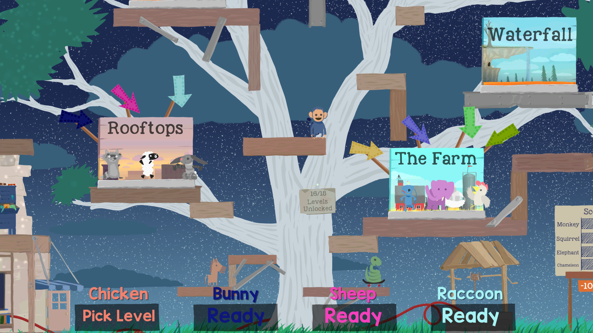

# Ultim8_mod
This mod allows up to 8 local players in Ultimate Chicken Horse.

### Install

Download [the latest release of Ultim8_mod](https://github.com/batram/Ultim8_mod/releases/latest) and extract the ZIP file into your Ultimate Chicken Horse folder (for example `C:\Program Files (x86)\Steam\steamapps\common\Ultimate Chicken Horse`). The files `Doorstop.dll`, `doorstop_config.ini`, `winhttp.dll` and the folder `Ultim8_mod` should end up next to the `UltimateChickenHorse.exe`.

You can start the game via Steam and if you have all controllers setup (check Steam Big Picture controller settings) play with up to 8 players in a local match.

### Mod Overview 

This mod uses [Doorstop](https://github.com/NeighTools/UnityDoorstop) to run custom code in the game Ultimate Chicken Horse.
The code patches serveral places where the number of players is hardcoded to 4. 
This is achieved by replacing functions with [MonoMod.RuntimeDetour](https://github.com/MonoMod/MonoMod/blob/master/README-RuntimeDetour.md). As well as increasing the capacity of some structucts that are setup for 4 players only.

### Build

    git clone https://github.com/batram/Ultim8_mod
    cd Ultim8_mod
    nuget restore
    dotnet build

The build depends on the `PropertyGroup` `UCHfolder` in `Ultim8_mod.csproj` to point to the correct Ultimate Chicken Horse game folder.
It is set to the default steam path:

    <PropertyGroup>
      <UCHfolder>C:\Program Files (x86)\Steam\steamapps\common\Ultimate Chicken Horse\</UCHfolder>
    </PropertyGroup>

Set the value to your correct install path if you get the following error:

    Build FAILED.

    EXEC : error : Set UCHfolder PropertyGroup in Ultim8_mod.csproj [C:\..\Ultim8_mod\Ultim8_mod\Ultim8_mod.csproj]
    EXEC : error : Not Found: "C:\Program Files (x86)\Steam\steamapps\common\Ultimate Chicken Horse\" [C:\..\Ultim8_mod\Ultim8_mod\Ultim8_mod.csproj]

You can also use Visual Studio to build the project.

### Screenshot

